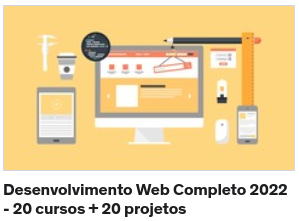

# Desenvolvimento Web Completo 2022 - 20 cursos + 20 projetos
 
<h5>Professor: Jorge Sant Ana</h5>
<h5>Professor: Jamilton Damasceno</h5>
 

## O que estudei neste curso
- HTML5 
- CSS3
- BootStrap 4
- JS
- ES6
- ES7
- PHP 7
- OO
- MySQL
- JQuery
- MVC
- API
- IONIC 
- Wordpress

<a href= "https://www.udemy.com/course/web-completo/">Desenvolvimento Web</a>

